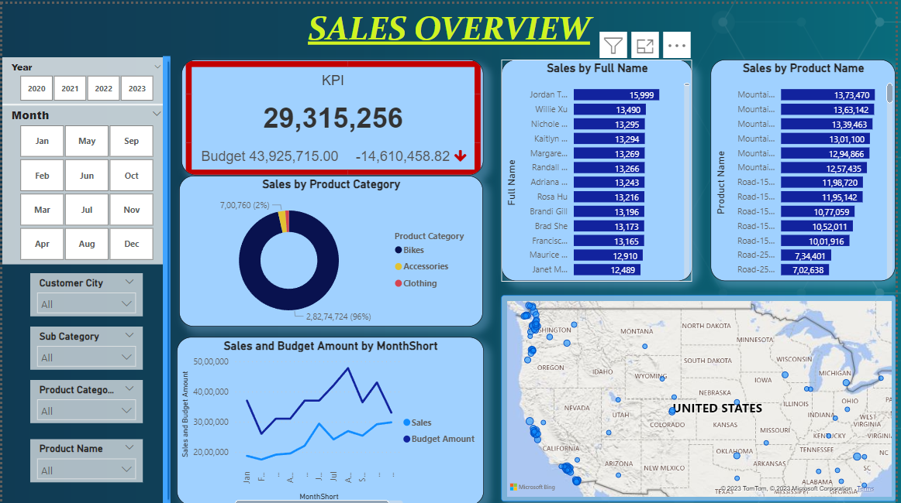
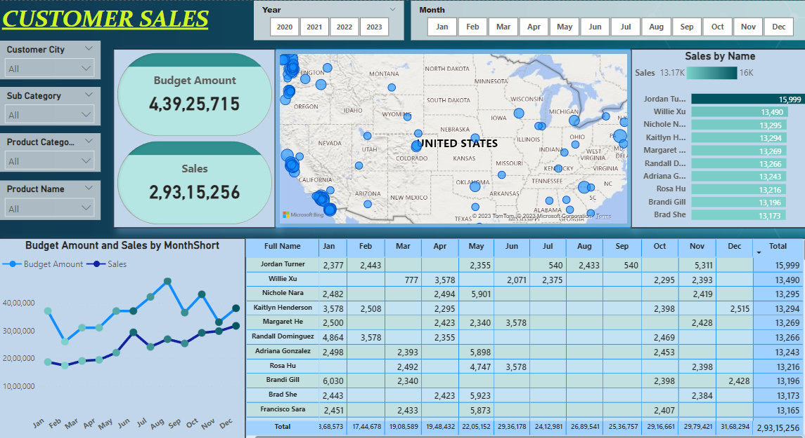
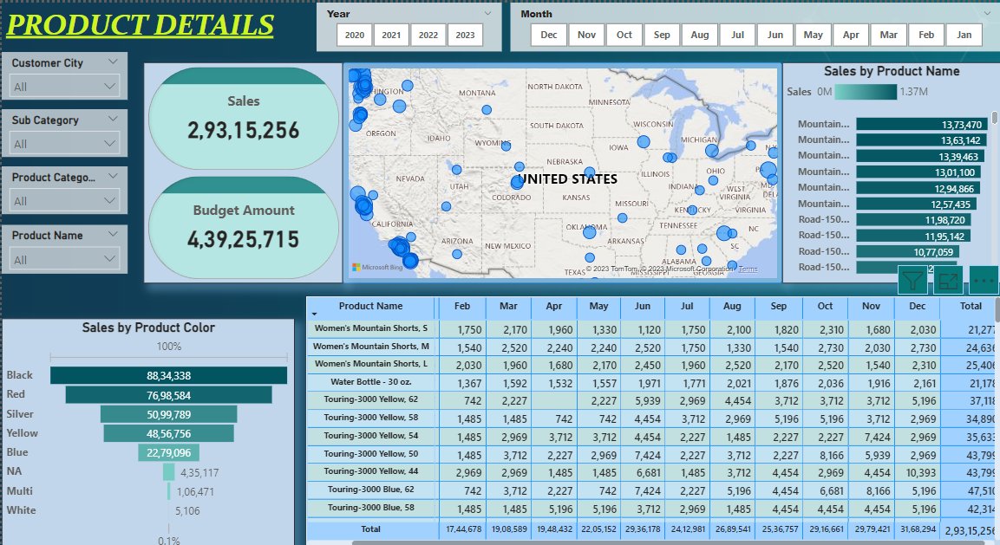

# Adventure Works Sales Report

---
## SQL QUERIES FOR THIS PROJECT
Click the link below to check the **SQL QUERIES** to transform the tables and choose selected columns for creating a Power BI dashboard.
https://github.com/Heysen3101/AdventureSalesPro/blob/main/sales.sql

## INTRODUCTION
This project provides a comprehensive dashboard analyzing Adventure Work's sales data. Utilizing SQL queries, the project updates and structures data into four key tables: Customer Details, Product Details, Calendar Details, and Sales Details. This data is then imported into Power BI as CSV files and transformed using Power Query.
**_Disclaimer_:** _The Dataset used for this report is used from the database from microsoft sample datasets.._

## Skills and Concepts Demonstrated
1) SQL Queries for Data Transformation
2) Power BI for Data Visualization
3) Power Query for Data Cleaning and Transformation
   
## PROBLEM STATEMENT
The dashboard aims to answer the following key business questions:
1) Sales Trends: How have sales evolved over time?
2) Customer Analysis: What are the customer demographics and buying patterns?
3) Product Analysis: Which products are bestsellers and which are underperforming?
4) Calendar Analysis: Are there seasonal trends or key dates that significantly affect sales?

## DASHBOARD 1

## DASHBOARD 2

## DASHBOARD 3

## INSIGHTS
**Dashboard 1:** This dashboard focuses on an overview of sales, with KPIs indicating the overall Budget Amount and annual sales. A donut chart reveals that bikes are the most sold items.

**Dashboard 2:** This dashboard offers a geographical analysis of customer behavior. It reveals that the majority of sales occur in the Western region of the United States, with minimal sales in the center. Monthly spending patterns are also displayed, offering insights into customer purchase frequency.

**Dashboard 3:** This dashboard showcases the most sold products and their monthly sales contributions. It allows for the identification of underperforming products, thereby informing production decisions. A funnel chart further analyzes sales by color, helping to tailor future product designs to customer preferences.

## REFERENCE
DATASET USED FOR THE PROJECT --> https://drive.google.com/drive/u/0/folders/1q2g5nhaoOoAyHTybX0g5_ZDPsvJOK0EN

